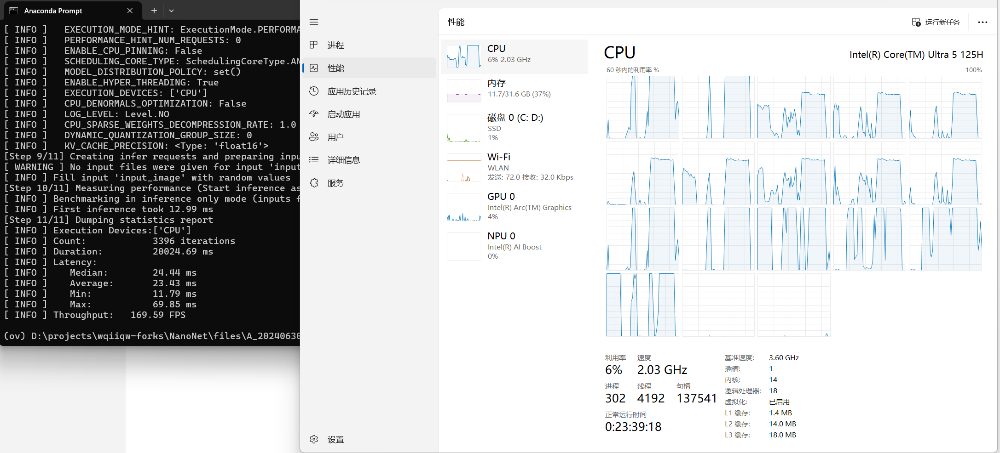
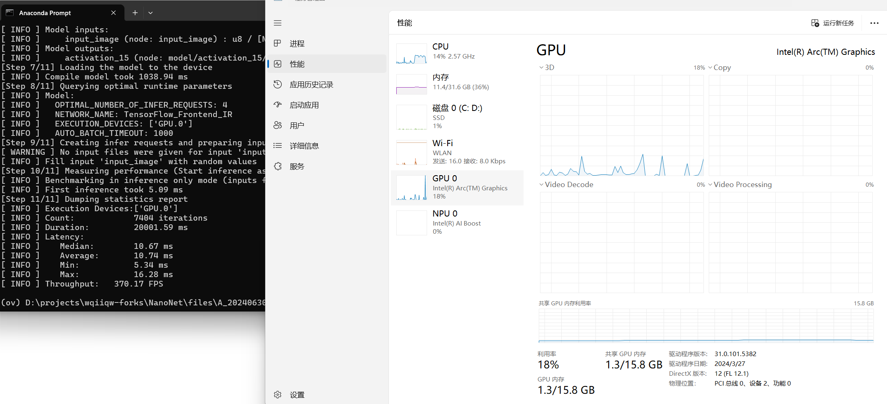
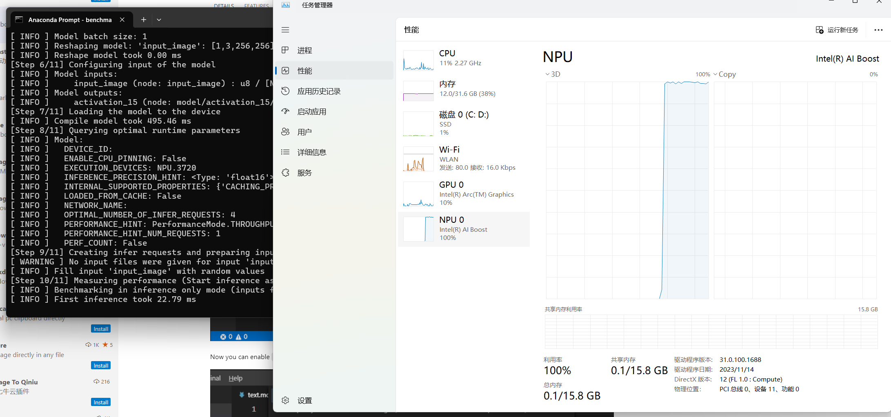

[toc]

# System Info
```
Name                           NumberOfCores MaxClockSpeed
----                           ------------- -------------
Intel(R) Core(TM) Ultra 5 125H            14          3600


PS C:\Users\conte> Get-WmiObject -Class Win32_VideoController | Format-List AcceleratorCapabilities, AdapterCompatibility, AdapterDACType, AdapterRAM, Availability, CapabilityDescriptions, Caption, DeviceID, DriverDate, DriverVersion


AcceleratorCapabilities :
AdapterCompatibility    : Intel Corporation
AdapterDACType          : Internal
AdapterRAM              : 134217728
Availability            : 3
CapabilityDescriptions  :
Caption                 : Intel(R) Arc(TM) Graphics
DeviceID                : VideoController1
DriverDate              : 20240327000000.000000-000
DriverVersion           : 31.0.101.5382
```


Certainly! Below is a summary of the results presented in a Markdown table:

| Device Type | Model Loading Time (ms) | Model Reshaping Time (ms) | Compile Model Time (ms) | First Inference Time (ms) | Total Iterations | Total Duration (ms) | Latency (ms) | Throughput (FPS) |
|--------------|--------------------------|---------------------------|-------------------------|----------------------|-------------------|--------------------|----------------|-------------------|
| CPU          | 15.20                    | 15.07                     | 111.41                  | 14.61                | 1668              | 10042.46            | Median: 20.76   | 166.09            |
|              |                          |                            |                         |                      |                   |                    | Average: 23.91  |                   |
|              |                          |                            |                         |                      |                   |                    | Min: 11.55       |                   |
|              |                          |                            |                         |                      |                   |                    | Max: 90.43       |                   |
| GPU          | 17.66                    | 0.00                      | 8119.39*                | 7.20                 | 3576              | 10029.86            | Median: 10.73   | 356.54            |
|              |                          |                            |                         |                      |                   |                    | Average: 11.14  |                   |
|              |                          |                            |                         |                      |                   |                    | Min: 5.41        |                   |
|              |                          |                            |                         |                      |                   |                    | Max: 16.54       |                   |
| NPU          | 14.19                    | 6.00                      | 1180.63                 | 51.11                | 932               | 10074.51            | Median: 42.83   | 92.51             |
|              |                          |                            |                         |                      |                   |                    | Average: 43.03  |                   |
|              |                          |                            |                         |                      |                   |                    | Min: 22.87       |                   |
|              |                          |                            |                         |                      |                   |                    | Max: 74.75       |                   |

**Notes:**
- The GPU compile model time is unusually long (8119.39 ms); this might be an error in the reported time or could indicate an issue with the GPU driver or setup.
- FPS (Frames Per Second) is a key indicator of the inference speed; the GPU shows significantly higher throughput compared to the CPU and NPU.
- The latency times include the median, average, minimum, and maximum latency, providing insight into the distribution of inference times and helping to assess model performance under different conditions.

This table summarizes the performance metrics for the model across CPU, GPU, and NPU devices, providing a clear comparison to aid in hardware selection for deployment.


# Results

```

(ov) D:\projects\wqiiqw-forks\NanoNet\files\A_20240630\model>
```

```
benchmark_app -shape [1,3,256,256] -m nanonet-fp32-shape-1-3-256-256-model.xml -t 10 -d CPU
benchmark_app -shape [1,3,256,256] -m nanonet-fp32-shape-1-3-256-256-model.xml -t 10 -d GPU
benchmark_app -shape [1,3,256,256] -m nanonet-fp32-shape-1-3-256-256-model.xml -t 10 -d NPU


```

```
(ov) D:\projects\wqiiqw-forks\NanoNet\files\A_20240630\model>benchmark_app -shape [1,3,256,256] -m nanonet-fp32-shape-1-3-256-256-model.xml -t 10
[Step 1/11] Parsing and validating input arguments
[ INFO ] Parsing input parameters
[Step 2/11] Loading OpenVINO Runtime
[ INFO ] OpenVINO:
[ INFO ] Build ................................. 2024.1.0-15008-f4afc983258-releases/2024/1
[ INFO ]
[ INFO ] Device info:
[ INFO ] CPU
[ INFO ] Build ................................. 2024.1.0-15008-f4afc983258-releases/2024/1
[ INFO ]
[ INFO ]
[Step 3/11] Setting device configuration
[ WARNING ] Performance hint was not explicitly specified in command line. Device(CPU) performance hint will be set to PerformanceMode.THROUGHPUT.
[Step 4/11] Reading model files
[ INFO ] Loading model files
[ INFO ] Read model took 15.20 ms
[ INFO ] Original model I/O parameters:
[ INFO ] Model inputs:
[ INFO ]     input_image (node: input_image) : f32 / [N,C,H,W] / [?,3,256,256]
[ INFO ] Model outputs:
[ INFO ]     activation_15 (node: model/activation_15/Sigmoid) : f32 / [...] / [?,256,256,1]
[Step 5/11] Resizing model to match image sizes and given batch
[ INFO ] Model batch size: 1
[ INFO ] Reshaping model: 'input_image': [1,3,256,256]
[ INFO ] Reshape model took 15.07 ms
[Step 6/11] Configuring input of the model
[ INFO ] Model inputs:
[ INFO ]     input_image (node: input_image) : u8 / [N,C,H,W] / [1,3,256,256]
[ INFO ] Model outputs:
[ INFO ]     activation_15 (node: model/activation_15/Sigmoid) : f32 / [...] / [1,256,256,1]
[Step 7/11] Loading the model to the device
[ INFO ] Compile model took 111.41 ms
[Step 8/11] Querying optimal runtime parameters
[ INFO ] Model:
[ INFO ]   NETWORK_NAME: TensorFlow_Frontend_IR
[ INFO ]   OPTIMAL_NUMBER_OF_INFER_REQUESTS: 4
[ INFO ]   NUM_STREAMS: 4
[ INFO ]   AFFINITY: Affinity.HYBRID_AWARE
[ INFO ]   INFERENCE_NUM_THREADS: 16
[ INFO ]   PERF_COUNT: NO
[ INFO ]   INFERENCE_PRECISION_HINT: <Type: 'float32'>
[ INFO ]   PERFORMANCE_HINT: THROUGHPUT
[ INFO ]   EXECUTION_MODE_HINT: ExecutionMode.PERFORMANCE
[ INFO ]   PERFORMANCE_HINT_NUM_REQUESTS: 0
[ INFO ]   ENABLE_CPU_PINNING: False
[ INFO ]   SCHEDULING_CORE_TYPE: SchedulingCoreType.ANY_CORE
[ INFO ]   MODEL_DISTRIBUTION_POLICY: set()
[ INFO ]   ENABLE_HYPER_THREADING: True
[ INFO ]   EXECUTION_DEVICES: ['CPU']
[ INFO ]   CPU_DENORMALS_OPTIMIZATION: False
[ INFO ]   LOG_LEVEL: Level.NO
[ INFO ]   CPU_SPARSE_WEIGHTS_DECOMPRESSION_RATE: 1.0
[ INFO ]   DYNAMIC_QUANTIZATION_GROUP_SIZE: 0
[ INFO ]   KV_CACHE_PRECISION: <Type: 'float16'>
[Step 9/11] Creating infer requests and preparing input tensors
[ WARNING ] No input files were given for input 'input_image'!. This input will be filled with random values!
[ INFO ] Fill input 'input_image' with random values
[Step 10/11] Measuring performance (Start inference asynchronously, 4 inference requests, limits: 10000 ms duration)
[ INFO ] Benchmarking in inference only mode (inputs filling are not included in measurement loop).
[ INFO ] First inference took 14.61 ms
[Step 11/11] Dumping statistics report
[ INFO ] Execution Devices:['CPU']
[ INFO ] Count:            1668 iterations
[ INFO ] Duration:         10042.46 ms
[ INFO ] Latency:
[ INFO ]    Median:        20.76 ms
[ INFO ]    Average:       23.91 ms
[ INFO ]    Min:           11.55 ms
[ INFO ]    Max:           90.43 ms
[ INFO ] Throughput:   166.09 FPS

(ov) D:\projects\wqiiqw-forks\NanoNet\files\A_20240630\model>benchmark_app -shape [1,3,256,256] -m nanonet-fp32-shape-1-3-256-256-model.xml -t 10 -d GPU
[Step 1/11] Parsing and validating input arguments
[ INFO ] Parsing input parameters
[Step 2/11] Loading OpenVINO Runtime
[ INFO ] OpenVINO:
[ INFO ] Build ................................. 2024.1.0-15008-f4afc983258-releases/2024/1
[ INFO ]
[ INFO ] Device info:
[ INFO ] GPU
[ INFO ] Build ................................. 2024.1.0-15008-f4afc983258-releases/2024/1
[ INFO ]
[ INFO ]
[Step 3/11] Setting device configuration
[ WARNING ] Performance hint was not explicitly specified in command line. Device(GPU) performance hint will be set to PerformanceMode.THROUGHPUT.
[Step 4/11] Reading model files
[ INFO ] Loading model files
[ INFO ] Read model took 17.66 ms
[ INFO ] Original model I/O parameters:
[ INFO ] Model inputs:
[ INFO ]     input_image (node: input_image) : f32 / [N,C,H,W] / [?,3,256,256]
[ INFO ] Model outputs:
[ INFO ]     activation_15 (node: model/activation_15/Sigmoid) : f32 / [...] / [?,256,256,1]
[Step 5/11] Resizing model to match image sizes and given batch
[ INFO ] Model batch size: 1
[ INFO ] Reshaping model: 'input_image': [1,3,256,256]
[ INFO ] Reshape model took 0.00 ms
[Step 6/11] Configuring input of the model
[ INFO ] Model inputs:
[ INFO ]     input_image (node: input_image) : u8 / [N,C,H,W] / [1,3,256,256]
[ INFO ] Model outputs:
[ INFO ]     activation_15 (node: model/activation_15/Sigmoid) : f32 / [...] / [1,256,256,1]
[Step 7/11] Loading the model to the device
[ INFO ] Compile model took 8119.39 ms
[Step 8/11] Querying optimal runtime parameters
[ INFO ] Model:
[ INFO ]   OPTIMAL_NUMBER_OF_INFER_REQUESTS: 4
[ INFO ]   NETWORK_NAME: TensorFlow_Frontend_IR
[ INFO ]   EXECUTION_DEVICES: ['GPU.0']
[ INFO ]   AUTO_BATCH_TIMEOUT: 1000
[Step 9/11] Creating infer requests and preparing input tensors
[ WARNING ] No input files were given for input 'input_image'!. This input will be filled with random values!
[ INFO ] Fill input 'input_image' with random values
[Step 10/11] Measuring performance (Start inference asynchronously, 4 inference requests, limits: 10000 ms duration)
[ INFO ] Benchmarking in inference only mode (inputs filling are not included in measurement loop).
[ INFO ] First inference took 7.20 ms
[Step 11/11] Dumping statistics report
[ INFO ] Execution Devices:['GPU.0']
[ INFO ] Count:            3576 iterations
[ INFO ] Duration:         10029.86 ms
[ INFO ] Latency:
[ INFO ]    Median:        10.73 ms
[ INFO ]    Average:       11.14 ms
[ INFO ]    Min:           5.41 ms
[ INFO ]    Max:           16.54 ms
[ INFO ] Throughput:   356.54 FPS

(ov) D:\projects\wqiiqw-forks\NanoNet\files\A_20240630\model>benchmark_app -shape [1,3,256,256] -m nanonet-fp32-shape-1-3-256-256-model.xml -t 10 -d NPU
[Step 1/11] Parsing and validating input arguments
[ INFO ] Parsing input parameters
[Step 2/11] Loading OpenVINO Runtime
[ INFO ] OpenVINO:
[ INFO ] Build ................................. 2024.1.0-15008-f4afc983258-releases/2024/1
[ INFO ]
[ INFO ] Device info:
[ INFO ] NPU
[ INFO ] Build ................................. 2024.1.0-15008-f4afc983258-releases/2024/1
[ INFO ]
[ INFO ]
[Step 3/11] Setting device configuration
[ WARNING ] Performance hint was not explicitly specified in command line. Device(NPU) performance hint will be set to PerformanceMode.THROUGHPUT.
[Step 4/11] Reading model files
[ INFO ] Loading model files
[ INFO ] Read model took 14.19 ms
[ INFO ] Original model I/O parameters:
[ INFO ] Model inputs:
[ INFO ]     input_image (node: input_image) : f32 / [N,C,H,W] / [?,3,256,256]
[ INFO ] Model outputs:
[ INFO ]     activation_15 (node: model/activation_15/Sigmoid) : f32 / [...] / [?,256,256,1]
[Step 5/11] Resizing model to match image sizes and given batch
[ INFO ] Model batch size: 1
[ INFO ] Reshaping model: 'input_image': [1,3,256,256]
[ INFO ] Reshape model took 6.00 ms
[Step 6/11] Configuring input of the model
[ INFO ] Model inputs:
[ INFO ]     input_image (node: input_image) : u8 / [N,C,H,W] / [1,3,256,256]
[ INFO ] Model outputs:
[ INFO ]     activation_15 (node: model/activation_15/Sigmoid) : f32 / [...] / [1,256,256,1]
[Step 7/11] Loading the model to the device
[ INFO ] Compile model took 1180.63 ms
[Step 8/11] Querying optimal runtime parameters
[ INFO ] Model:
[ INFO ]   DEVICE_ID:
[ INFO ]   ENABLE_CPU_PINNING: False
[ INFO ]   EXECUTION_DEVICES: NPU.3720
[ INFO ]   INFERENCE_PRECISION_HINT: <Type: 'float16'>
[ INFO ]   INTERNAL_SUPPORTED_PROPERTIES: {'CACHING_PROPERTIES': 'RO'}
[ INFO ]   LOADED_FROM_CACHE: False
[ INFO ]   NETWORK_NAME:
[ INFO ]   OPTIMAL_NUMBER_OF_INFER_REQUESTS: 4
[ INFO ]   PERFORMANCE_HINT: PerformanceMode.THROUGHPUT
[ INFO ]   PERFORMANCE_HINT_NUM_REQUESTS: 1
[ INFO ]   PERF_COUNT: False
[Step 9/11] Creating infer requests and preparing input tensors
[ WARNING ] No input files were given for input 'input_image'!. This input will be filled with random values!
[ INFO ] Fill input 'input_image' with random values
[Step 10/11] Measuring performance (Start inference asynchronously, 4 inference requests, limits: 10000 ms duration)
[ INFO ] Benchmarking in inference only mode (inputs filling are not included in measurement loop).
[ INFO ] First inference took 51.11 ms
[Step 11/11] Dumping statistics report
[ INFO ] Execution Devices:NPU.3720
[ INFO ] Count:            932 iterations
[ INFO ] Duration:         10074.51 ms
[ INFO ] Latency:
[ INFO ]    Median:        42.83 ms
[ INFO ]    Average:       43.03 ms
[ INFO ]    Min:           22.87 ms
[ INFO ]    Max:           74.75 ms
[ INFO ] Throughput:   92.51 FPS
```

# CPU



# GPU



# NPU


